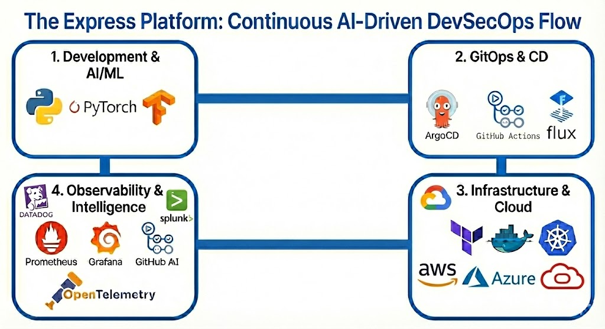
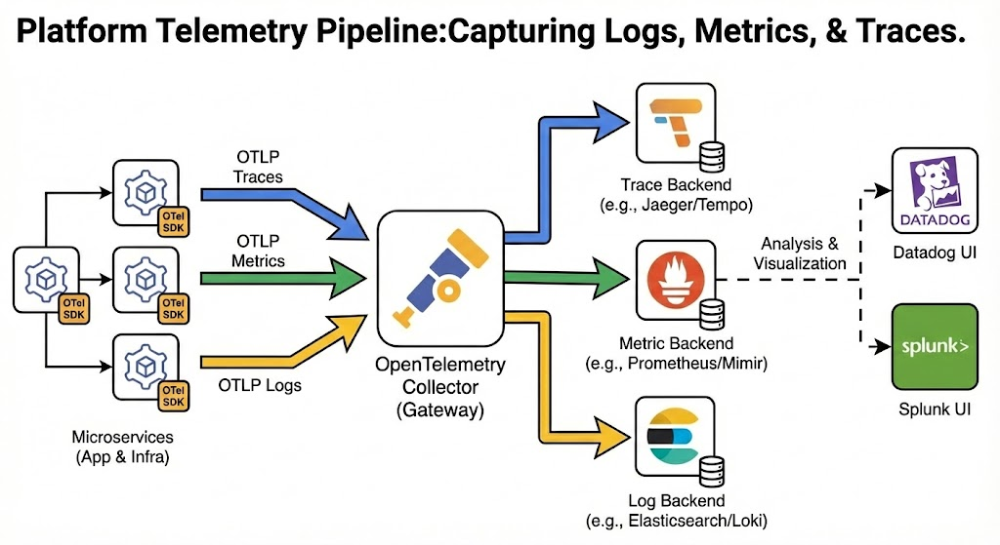
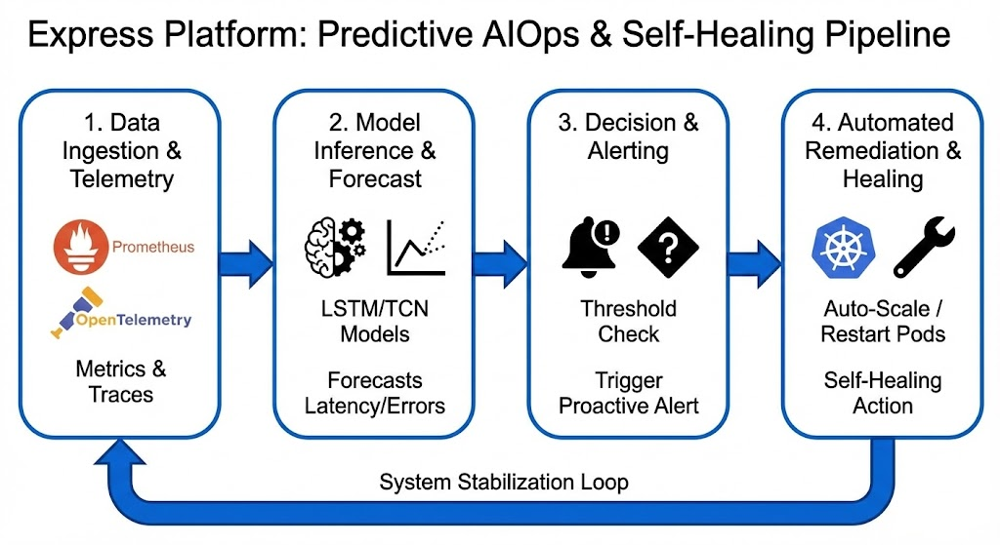

# Enterprise Case Study — Modernizing Express Web App v6
## Terraform • Amazon EKS • Helm • ArgoCD GitOps • AIOps • DevSecOps • FinOps
### **Built by Emmanuel Naweji — Cloud | DevOps | SRE | FinOps | AI Engineer Ph. D. Candidate focusing on AI/ML in Healthcare**

---

# Executive Summary
This case study demonstrates how a legacy Express.js backend was transformed into a **cloud‑native, enterprise-grade, globally scalable, self-healing platform** using Terraform, Amazon EKS, Helm, ArgoCD GitOps, Prometheus, Grafana, AIOps automation, DevSecOps pipelines, and FinOps cost governance.

The infrastructure mirrors real-world patterns used by many companies. For example:
- **Netflix**
- **Riot Games**
- **Epic Games**
- **Roblox**
- **Disney+**
- **Shopify**
- **Coinbase**

These companies rely on Kubernetes, GitOps, IaC, AIOps, and FinOps at massive scale—the same patterns implemented in this project.

---

# Business Problem
Legacy Express.js apps typically suffer from:
- Manual deployments
- No autoscaling or resilience
- No centralized monitoring
- No anomaly detection
- No cost visibility
- No GitOps consistency
- No DevSecOps scanning

This results in outages, slow delivery, high cost, and unreliable operations.

---

# Enterprise Transformation Strategy
We redesigned the system using:

### **Cloud & Orchestration**
- AWS EKS (Managed Kubernetes)
- VPC, Subnets, NAT, ALB

### **IaC**
- Terraform for all infrastructure

### **Application Deployment**
- Helm chart packaging
- ArgoCD GitOps automation

### **Observability**
- Prometheus Operator
- AlertManager
- Grafana dashboards

### **AIOps**
- Custom anomaly detection
- Traffic simulation
- Latency/error-rate monitoring

### **FinOps**
- Pod-level cost visibility
- Resource utilization analytics

### **DevSecOps**
- Trivy scanning for:
  - Docker images
  - Terraform IaC
  - K8s manifests
  - Helm charts

---

# Project Structure
```text
express-t2s-app-v6/
├── app/                  # Express Application
├── aiops-service/        # Python AIOps Engine
├── charts/               # Helm Charts
│   ├── express-web-app/
│   ├── aiops/
│   ├── grafana/
│   └── prometheus/
├── argocd/               # ArgoCD Manifests
├── scripts/              # Automation Scripts
│   ├── cleanup.sh
│   ├── finops-test.sh
│   ├── force_destroy.sh
│   ├── generate-traffic.sh
│   ├── port-forward-aiops.sh
│   └── trivy-scan.sh
├── terraform/            # Infrastructure as Code
│   ├── backend/
│   ├── ecr/
│   └── eks/
└── README.md
````

-----

# Architecture Diagram

<p align="center">
  
</p>

-----

# Real Companies Using This Architecture

| Company      | Technology Alignment |
|--------------|----------------------|
| Netflix      | Kubernetes, ArgoCD, Prometheus, Terraform |
| Riot Games   | Global K8s + Observability |
| Epic Games   | Autoscaling infra for Fortnite |
| Disney+      | EKS + Terraform IaC |
| Roblox       | High-scale multi-region Kubernetes |
| Shopify      | Kubernetes + FinOps cost management |
| Coinbase     | Terraform + K8s + High Security |

Your system now reflects the same world‑class patterns.

-----

# Deployment Guide — Full Steps

## **STEP 1 — Provision Terraform Backend**

```bash
cd terraform/backend
terraform init
terraform apply -auto-approve
```

## **STEP 2 — Build & Push Image to ECR**

```bash
cd terraform/ecr
terraform init && terraform apply -auto-approve
chmod +x build_and_push.sh
bash build_and_push.sh
```

## **STEP 3 — Provision the EKS Cluster**

```bash
cd terraform/eks
terraform init
terraform apply -auto-approve
```

## **STEP 4 — Configure kubectl**

```bash
aws eks update-kubeconfig --region us-east-1 --name t2s-eks
kubectl get nodes
```

## **STEP 5 — Deploy Monitoring & Express App**

**1. Install kube-prometheus-stack (CRDs & Stack)**

```bash
cd ../..
helm repo add prometheus-community [https://prometheus-community.github.io/helm-charts](https://prometheus-community.github.io/helm-charts)
helm repo update

helm upgrade --install kube-prometheus-stack prometheus-community/kube-prometheus-stack \
  -n monitoring --create-namespace
```

**2. Deploy the Express App**

```bash
helm upgrade --install express-web-app ./charts/express-web-app -n apps --create-namespace
```

-----

# Monitoring Stack — Prometheus & Grafana

<p align="center">
  
</p>

**1. Install Custom Grafana Chart**

```bash
helm upgrade --install grafana ./charts/grafana -n monitoring
```

**2. Get Grafana Password**

```bash
kubectl --namespace monitoring get secrets kube-prometheus-stack-grafana \
  -o jsonpath="{.data.admin-password}" | base64 -d
```

**3. Port‑forward Grafana**

```bash
kubectl --namespace monitoring port-forward svc/kube-prometheus-stack-grafana 3000:80
```

*Access Grafana at http://localhost:3000*

-----

# Deploy AIOps Engine

<p align="center">
  
</p>

**1. Build & Push AIOps Image**

```bash
chmod +x scripts/build_and_push_aiops.sh
bash scripts/build_and_push_aiops.sh
```

**2. Deploy AIOps App**

```bash
helm upgrade --install aiops ./charts/aiops -n aiops --create-namespace
```

**3. Port-forward Dashboard**

```bash
bash scripts/port-forward-aiops.sh
```

**4. Simulate High Traffic**

```bash
bash scripts/generate-traffic.sh
```

**Expected outcomes:**

  - Latency spikes detected
  - Error-rate anomalies logged
  - Alerts generated
  - Prometheus metrics updated

-----

# Deploy ArgoCD (GitOps)

<p align="center">
  
</p>

**1. Install ArgoCD**

```bash
kubectl create namespace argocd
helm repo add argo [https://argoproj.github.io/argo-helm](https://argoproj.github.io/argo-helm)
helm repo update

helm upgrade --install argocd argo/argo-cd -n argocd --set server.service.type=ClusterIP
```

**2. Deploy GitOps App**

```bash
kubectl apply -f argocd/express-web-app.yaml
```

**3. Access ArgoCD over the Browser**

```bash
kubectl --namespace argocd port-forward svc/argocd-server 8080:443
```

**4. Get Admin Password**

```bash
kubectl -n argocd get secret argocd-initial-admin-secret \
  -o jsonpath="{.data.password}" | base64 -d
```

**ArgoCD Capabilities:**

  - Auto-syncs deployments
  - Corrects drift
  - Provides rollbacks
  - Enforces GitOps source-of-truth

-----

# Testing AIOps, FinOps & DevSecOps

### **AIOps Validation**

Simulate workloads:

```bash
bash scripts/generate-traffic.sh
```

Observe AIOps dashboard:

```bash
bash scripts/port-forward-aiops.sh
```

### **FinOps Validation**

```bash
bash scripts/finops-test.sh
```

*Output includes: CPU/memory overprovisioning, Cost anomaly alerts, Pod cost estimation.*

### **DevSecOps Validation**

```bash
bash scripts/trivy-scan.sh
```

*Scans: Docker images, Terraform modules, Kubernetes manifests, Helm charts.*

-----

# Next Steps: AIOps 2.0 — Prediction & Remediation

The current system detects anomalies in real-time. The next phase of this project adds **predictive intelligence** and **automated self-healing** layers to achieve a fully autonomous (Level 5) platform.

### **Layer 1: Predictive Modeling (Forecasting)**
* **Goal:** Move from *Reactive* scaling to *Proactive* pre-scaling.
* **Implementation:**
    * Integrate **LSTM (Long Short-Term Memory)** neural networks or **Facebook Prophet** to analyze historical Prometheus metrics.
    * **Outcome:** Predict traffic spikes 30 minutes in advance and pre-warm EKS nodes, eliminating cold-start latency during flash sales or morning rushes.

### **Layer 2: Automated Remediation (Self-Healing)**
* **Goal:** Close the loop between *Alerting* and *Fixing* without human intervention.
* **Implementation:**
    * Connect AIOps alerts to **Argo Events** or **AWS Lambda** webhooks.
    * **Use Cases:**
        * **Memory Leaks:** Automatically restart pods exhibiting specific memory leak patterns *before* they crash.
        * **Database Contention:** Temporarily implement aggressive caching policies when DB latency thresholds are breached.
        * **Security Response:** Automatically update AWS WAF rules to block IPs showing bot-like anomaly patterns.

-----

# Cleanup (Safe VPC + EKS Teardown)

Execute these steps to destroy the infrastructure and avoid costs.

**1. Delete Kubernetes Resources**

```bash
kubectl delete deployment aiops-api -n aiops
kubectl delete service aiops-api -n aiops
kubectl delete configmap aiops-api-config -n aiops --ignore-not-found
kubectl delete serviceaccount aiops-sa -n aiops --ignore-not-found
kubectl delete pod -l app=aiops-api -n aiops --ignore-not-found
```

**2. Run Cleanup Script**

```bash
chmod +x scripts/cleanup.sh
export FORCE_TERMINATE_INSTANCES=true
AWS_REGION=us-east-1 VPC_ID=<your-vpc-id> bash scripts/cleanup.sh
```

**3. Destroy EKS Cluster**

```bash
cd terraform/eks
terraform destroy -auto-approve
```

**4. Destroy ECR Repositories**

```bash
cd ../ecr
# Delete images before destroying repository
aws ecr batch-delete-image --repository-name t2s-express-app --image-ids imageTag=latest
aws ecr batch-delete-image --repository-name aiops-api --image-ids imageTag=latest

terraform destroy -auto-approve
```

**5. Destroy Backend/VPC**

```bash
cd ../..
terraform destroy -auto-approve
```

**Destroys:** EKS cluster, Node groups, Load balancers, NAT GWs, Subnets, Security Groups, and VPC.

-----

# Final Outcome

This modernization delivers:

✔ Enterprise-grade resiliency
✔ Autoscaling Kubernetes platform
✔ GitOps automated workflows
✔ Production-grade monitoring (SLIs/SLOs)
✔ AIOps anomaly detection
✔ FinOps cost governance
✔ Zero‑downtime deployments
✔ Secure DevSecOps pipelines

-----

# Author

**Emmanuel Naweji (2025)**
Cloud | DevOps | SRE | FinOps | AI Engineer | Ph. D. Candidate focusing on AI/ML in Healthcare
Building enterprise cloud platforms and training engineers into the top 1% through real‑world, automation-driven solutions.

```
```
